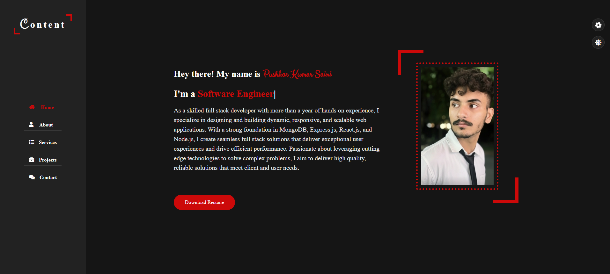

# 🚀 Pushkar Kumar Saini's Portfolio

Welcome to my personal portfolio repository! This project showcases my skills, projects, and experiences as a developer.

🔗 **Live Site**: [portfolio-sigma-eosin-73.vercel.app](https://portfolio-sigma-eosin-73.vercel.app/)



---

## 📄 Table of Contents

- [About](#about)
- [Features](#features)
- [Tech Stack](#tech-stack)
- [Getting Started](#getting-started)
- [Contact](#contact)


---

## 📌 About

This portfolio represents my journey as a developer, highlighting my skills, projects, and achievements. It’s designed to be clean, professional, and user-friendly across all devices.

---

## ✨ Features

- Responsive design
- Smooth UI transitions
- Project showcase with descriptions
- Resume download
- Contact form integration

---

## 🛠️ Tech Stack

- **Frontend**: HTML5, CSS3, JavaScript
- **Technologies**: Email JS
- **Hosting**: Vercel

---

## 🚀 Getting Started

To run this project locally:

```bash
git clone https://github.com/pushkarkumarsaini2006/My-Portfolio.git
cd My-Portfolio
# Open index.html in browser or use Live Server
```
---
## 📬 Contact

Feel free to reach out to me:

- 📧 **Email**: [pushkarkumarsaini2006@gmail.com](mailto:pushkarkumarsaini2006@gmail.com)  
- 💼 **LinkedIn**: [Pushkar Kumar Saini](https://www.linkedin.com/in/pushkar-kumar-saini153600)  
- 🧑‍💻 **GitHub**: [pushkarkumarsaini2006](https://github.com/pushkarkumarsaini2006)

---

Thank you for visiting my portfolio!  
If you have any feedback or suggestions, feel free to open an issue or submit a pull request.

 
